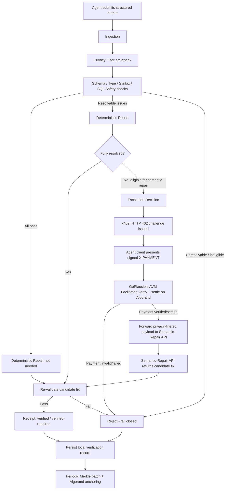
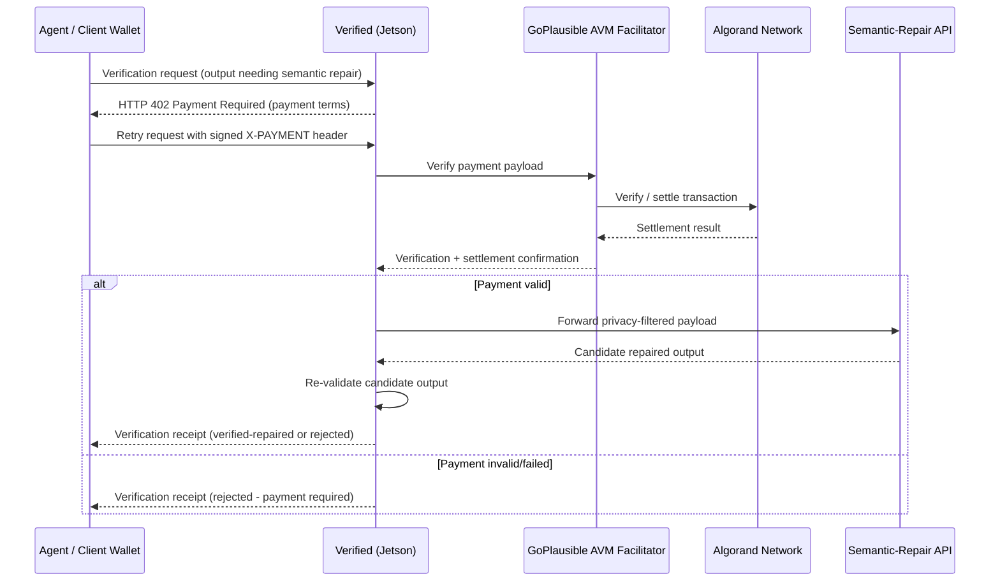
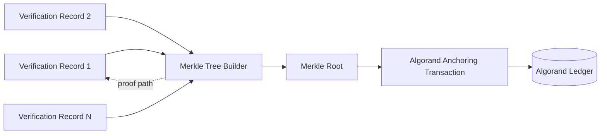
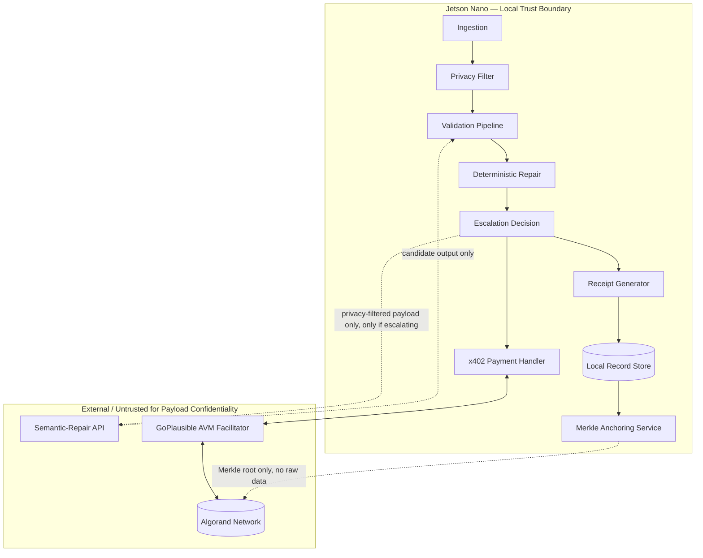

# ARCHITECTURE.md — Verified

## 1. Purpose

This document defines the system architecture for Verified: component responsibilities, trust boundaries, and the control/data flow across the local validation pipeline, deterministic repair, semantic-repair escalation, x402 payment flow, GoPlausible facilitator interaction, Algorand settlement, receipt generation, and Merkle-root anchoring.

No implementation code is included. Any component whose concrete technology is not specified by the project brief is marked **TBD** with an explanation of the decision required.

## 2. Deployment Context

- Verified's local components run **on a Jetson Nano**, co-located with (or adjacent to) the AI agent whose output it verifies.
- The Jetson Nano is treated as a semi-trusted edge device: trusted to execute Verified's own logic correctly, but assumed to be network-constrained/intermittent and physically closer to potential tampering than a cloud environment.
- The **semantic-repair API** is an external, paid service reachable over the network. It is treated as untrusted with respect to payload confidentiality beyond what is explicitly sent to it, and untrusted with respect to the correctness of its output (its output is always re-validated).
- The **GoPlausible AVM facilitator** and **Algorand network** are external trust anchors used specifically for (a) payment verification/settlement and (b) audit anchoring. They are not trusted with any raw payload data.

## 3. High-Level Component Overview

| Component | Responsibility | Location |
|---|---|---|
| Ingestion / Request Handler | Accepts verification requests from the agent, normalizes them | Jetson (local) |
| Schema Validator | Validates structured output against declared schema | Jetson (local) |
| Type Checker | Validates field-level types against schema/policy expectations | Jetson (local) |
| Syntax Checker | Validates syntax of code-like outputs (e.g., SQL) | Jetson (local) |
| SQL Safety Checker | Detects unsafe SQL constructs/statement classes | Jetson (local) |
| Privacy Filter | Detects/redacts content that must not leave the device | Jetson (local) |
| Deterministic Repair Engine | Applies bounded, rule-based fixes | Jetson (local) |
| Escalation Decision Logic | Decides whether local outcome is sufficient or semantic repair is required | Jetson (local) |
| x402 Payment Handler | Issues HTTP 402 challenges, receives `X-PAYMENT`, coordinates with facilitator | Jetson (local), talks to external facilitator |
| GoPlausible AVM Facilitator Client | Submits payment verification/settlement requests | External service (Algorand) |
| Semantic-Repair API Client | Sends privacy-filtered payload for semantic repair, receives candidate fix | External service |
| Re-validation Pipeline | Re-runs the same local validation pipeline on repaired output | Jetson (local) |
| Receipt Generator | Builds the verification receipt, computes hashes | Jetson (local) |
| Local Verification Record Store | Persists verification records/receipts locally | Jetson (local) |
| Merkle Anchoring Service | Batches records, computes Merkle root, submits anchoring transaction | Jetson (local), talks to Algorand |
| Algorand Network | Settles x402 payments; stores anchored Merkle roots | External (public ledger) |

## 4. Local Verification Pipeline

### 4.1 Stage Order (MVP)

1. **Ingestion** — request normalized (see DATA_MODEL.md for request shape).
2. **Privacy Filter (pre-check)** — payload scanned for content that must never leave the device, independent of whether escalation ends up happening. This runs early so that no downstream stage accidentally logs/forwards sensitive content.
3. **Schema Validation** — output checked against the referenced schema.
4. **Type Checking** — field types checked against schema/policy-declared types.
5. **Syntax Checking** — for outputs that are themselves code (e.g., SQL statements), syntax is parsed/checked.
6. **SQL Safety Checking** — for SQL outputs, statement class and pattern checks run (see THREAT_MODEL.md for threat coverage; exact rule set is TBD, see §4.3).
7. **Deterministic Repair (if issues found and eligible)** — bounded rule-based fixes applied.
8. **Escalation Decision** — if unresolved issues remain after deterministic repair, and those issues are of a class eligible for semantic repair, escalate; otherwise reject.

### 4.2 Deterministic Repair — Scope Discipline

Deterministic repair is restricted to changes that are **unambiguous and rule-derivable from the schema/policy alone** — no semantic judgment. Examples of the *category* of fix (final enumerated list is an MVP implementation decision, TBD):
- Coercing a value into a schema-declared type when the coercion is lossless and unambiguous (e.g., numeric string → number, per schema).
- Structural fixes such as whitespace/formatting normalization.
- Filling a field with a schema-declared default when the field is missing and a default is explicitly defined in the schema/policy — never inventing a value.

Explicitly **out of scope** for deterministic repair (must escalate or reject instead):
- Any fix that requires inferring intent (e.g., guessing which of several plausible values was "meant").
- Any rewrite of SQL logic — deterministic repair does not "fix" unsafe SQL by rewriting it; unsafe SQL is rejected or escalated, never silently rewritten into something that changes semantics (see THREAT_MODEL.md).

**TBD:** The exact enumerated rule set for deterministic repair, and the exact schema/typing formalism used to express it (e.g., which schema description format), is an implementation decision to be finalized before/during build — this document intentionally does not assume a specific schema language or validation library.

### 4.3 SQL Safety Checking — Scope

SQL safety checking determines whether a SQL output falls into an unsafe class (e.g., structurally indicates destructive or overly broad operations) as opposed to being merely syntactically valid. **TBD:** the exact rule set / classification approach (e.g., statement allow-listing vs. pattern detection vs. static analysis depth) and which SQL dialect(s) are supported in the MVP demo are open implementation decisions. This document specifies that such a check exists and gates execution, not its internal algorithm.

### 4.4 Privacy Filtering — Scope

The Privacy Filter is responsible for identifying payload content that must not leave the Jetson under any circumstances, and content that may leave only if escalation is required and only in filtered/minimized form. **TBD:** the exact taxonomy of sensitive content categories and the filtering mechanism (e.g., pattern-based detection vs. policy-declared field-level sensitivity tags) is an implementation decision. Architecturally, this stage runs before any data leaves the device, without exception.

## 5. Escalation & Semantic Repair Flow

Escalation occurs only when local validation/deterministic repair cannot resolve all detected issues **and** the unresolved issue class is one for which semantic repair is architecturally permitted (per §4.2/§4.3, unsafe SQL is not eligible for silent semantic rewriting into a "safer" query — that is a rejection case, not a repair case, unless a future policy explicitly allows a constrained semantic classification role; MVP treats unsafe SQL as reject-or-escalate-for-classification-only, not reject-or-auto-fix).

### 5.1 x402 Payment Sequence

**TBD (explicitly deferred, not invented here):**
- The exact x402 payment terms encoding (price, asset used on Algorand, expiry) — governed by whatever x402/GoPlausible facilitator conventions are adopted; this document does not assume specific pricing.
- Custody model for the agent's signing key/wallet (agent-held vs. client-held) — noted as a decision point in PRD.md §4 (Non-Goals) and DESIGN.md.

## 6. Re-validation Principle

Per Architecture Principle 4 ("Verify after repair"), **any** repaired output — whether from deterministic repair or the semantic-repair API — is passed back through the same validation pipeline stages described in §4 before it can result in a `verified` outcome. A semantic-repair API response is never trusted directly. This is enforced structurally: the Re-validation Pipeline is not a distinct implementation from the initial validation pipeline — it is the same pipeline, invoked again.

## 7. Verification Receipts

A verification receipt is produced for **every** request regardless of outcome (Architecture Principle 5, "Proof before execution"). The receipt:
- States the outcome (`verified`, `verified-repaired`, or `rejected`).
- Is cryptographically bound to: the output that was actually verified (post-repair, if repair occurred), the schema/policy referenced, repair information (what was changed and by which mechanism — deterministic or semantic), and the validator version that produced the outcome (Architecture Principle 7, "Tamper evidence").
- Includes hashes rather than raw payload content wherever the receipt itself might be shared or anchored beyond the local environment.

Exact hash algorithm(s) and receipt serialization format are **TBD** (see DATA_MODEL.md) — not invented here beyond "cryptographic hash," per the constraint against inventing unspecified technology choices.

## 8. Local Verification Records & Merkle Anchoring

- Every verification outcome (pass, repaired-pass, reject) is persisted as a local verification record on the Jetson (Architecture Principle 6, "Off-chain data, on-chain evidence" — raw payloads never leave this local record store for anchoring purposes).
- Periodically (interval/trigger condition **TBD** — e.g., time-based, count-based, or manually triggered for the demo), the Merkle Anchoring Service:
  1. Selects a batch of local verification records not yet anchored.
  2. Computes a Merkle tree over their receipt hashes.
  3. Submits the resulting Merkle root as an Algorand transaction.
  4. Records the resulting Algorand transaction reference against each included local record, enabling later proof of inclusion.
- Only the Merkle root (and transaction metadata) touches Algorand. No raw payload, no individual receipt content, is placed on-chain.

## 9. Trust Boundaries

Key boundary rules:
- Data crosses from the trusted local boundary to the semantic-repair API **only** when escalation is triggered, **only** after privacy filtering, and **only** the payload — never the receipt private material.
- Data crosses to the facilitator/Algorand **only** as payment protocol data (for the x402 flow) or Merkle roots (for anchoring) — never as raw verification payloads.
- Output returned from the semantic-repair API is never trusted directly; it re-enters the trusted boundary only through the Validation Pipeline (§6).

## 10. Failure Handling (Architecture-Level)

Per Principle 8 ("Fail closed"):
- Facilitator unreachable / payment verification failure → reject (no semantic repair attempted).
- Semantic-Repair API unreachable / error / timeout → reject.
- Re-validation of a candidate repair fails → reject (never fall back to trusting the unvalidated candidate).
- Algorand anchoring failure → does **not** block issuance of receipts to the agent (anchoring is an audit-integrity process, not a gate on the agent's execution decision); it is retried, and unanchored records are tracked until successfully anchored. This distinction matters: the *receipt* gates execution; *anchoring* provides longer-horizon tamper evidence. A pending anchor does not mean a passing receipt is invalid — it means audit proof is not yet externally verifiable.
- See TESTING.md and THREAT_MODEL.md for the corresponding test scenarios and threats.

## 11. Open Architectural TBDs (Consolidated)

| Area | Decision Needed |
|---|---|
| Schema/typing formalism | Which schema description approach is used for validation (language-agnostic in this document) |
| Deterministic repair rule set | Final enumerated list of safe, rule-based fixes |
| SQL safety rule set / dialect | Classification approach and supported SQL dialect(s) |
| Privacy filter taxonomy | Sensitive-content categories and detection mechanism |
| Hash algorithm(s) | Specific cryptographic hash function(s) used for receipts and Merkle tree |
| Receipt serialization format | Concrete format for receipt storage/transmission |
| x402 payment terms | Price, asset, expiry conventions used in the 402 challenge |
| Wallet/key custody | Where the agent's Algorand signing key is held |
| Anchoring trigger | Time-based, count-based, or manual trigger for Merkle batching in the demo |

These are intentionally left open per the constraint against inventing unspecified technologies; they should be resolved and recorded (e.g., in TASKS.md as concrete milestones) as the hackathon team makes implementation decisions.
