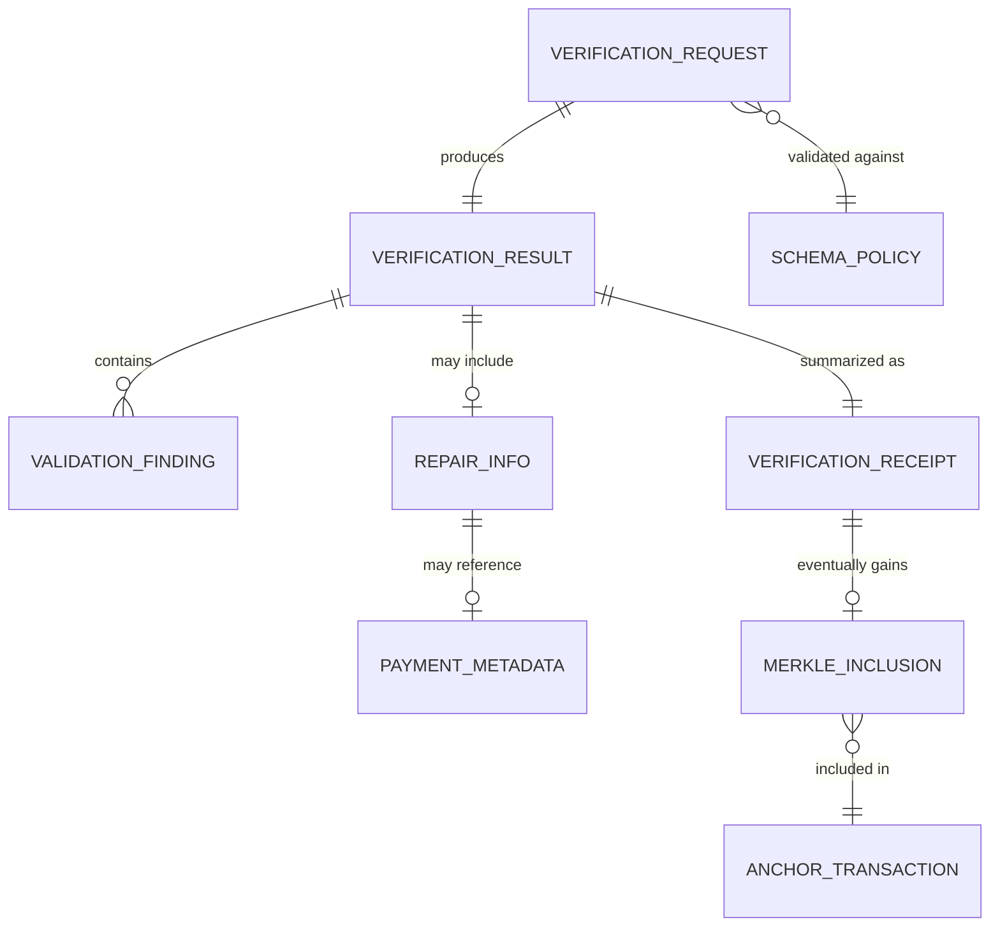

# DATA_MODEL.md — Verified

## 1. Purpose

This document defines the conceptual data model for Verified: the entities involved in a verification request, the schemas/policies they are checked against, validation and repair results, receipts, hashes, payment metadata, and audit/Merkle records. It is intentionally **database-agnostic** — no specific storage technology is assumed. Field types below are described conceptually (string, integer, timestamp, enum, hash, reference) rather than as a concrete schema-language or SQL DDL.

## 2. Entity Overview

## 3. Entities

### 3.1 VerificationRequest

Represents a single request from an agent to verify a piece of structured output.

| Field | Type (conceptual) | Notes |
|---|---|---|
| request_id | identifier | Unique per request |
| submitted_at | timestamp | When the agent submitted the request |
| output_type | enum: `json` \| `sql` \| `function_call_args` | Determines which pipeline stages apply (e.g., SQL safety only for `sql`) |
| output_payload | opaque structured data | The AI-generated output to verify. Never stored in on-chain artifacts. |
| schema_ref | reference → SchemaPolicy | Which schema/policy to validate against |
| agent_identifier | identifier | Identifies the requesting agent (format TBD — not assumed to be a specific auth scheme) |
| privacy_class_hint | enum (optional) | Agent-declared sensitivity hint, if provided; does not replace local privacy filtering |

### 3.2 SchemaPolicy

Represents the schema and associated policy rules a given output type/domain is checked against.

| Field | Type (conceptual) | Notes |
|---|---|---|
| schema_id | identifier | Unique |
| version | string/integer | Schema versioning — required so receipts can bind to an exact schema version |
| output_type | enum | Matches VerificationRequest.output_type |
| schema_definition | opaque schema representation | Exact schema formalism **TBD** (see ARCHITECTURE.md §4.2) |
| deterministic_repair_rules_ref | reference (optional) | Points to the enumerated deterministic repair rule set applicable, if any |
| sql_safety_ruleset_ref | reference (optional) | Applicable only when output_type = `sql` |
| privacy_policy_ref | reference | Which privacy filtering rules apply |

### 3.3 ValidationFinding

Represents a single issue (or confirmation of correctness) found during a validation pipeline stage.

| Field | Type (conceptual) | Notes |
|---|---|---|
| finding_id | identifier | Unique within a VerificationResult |
| stage | enum: `schema` \| `type` \| `syntax` \| `sql_safety` \| `privacy` | Which pipeline stage produced this finding |
| severity | enum: `info` \| `warning` \| `blocking` | `blocking` findings must be resolved (repaired) or the request is rejected |
| description | string | Human-readable explanation |
| field_path | string (optional) | Path within the payload the finding relates to, if applicable |
| repairable | enum: `deterministic` \| `semantic` \| `not_repairable` | Drives escalation decision logic |

### 3.4 RepairInfo

Represents what was changed, if anything, to move a request from failing to passing validation.

| Field | Type (conceptual) | Notes |
|---|---|---|
| repair_id | identifier | Unique |
| repair_type | enum: `deterministic` \| `semantic` \| `none` | |
| findings_addressed | list of reference → ValidationFinding | Which findings this repair targeted |
| pre_repair_output_hash | hash | Hash of the payload before repair |
| post_repair_output_hash | hash | Hash of the payload after repair |
| deterministic_rule_refs | list of reference (optional) | Which deterministic rules were applied, if repair_type = `deterministic` |
| semantic_repair_provider_ref | reference (optional) | Identifies the semantic-repair API/provider used, if repair_type = `semantic` |
| payment_ref | reference → PaymentMetadata (optional) | Present only if repair_type = `semantic` |

### 3.5 PaymentMetadata

Represents the x402 payment associated with a semantic-repair escalation. Present only when semantic repair was attempted (whether or not it ultimately succeeded).

| Field | Type (conceptual) | Notes |
|---|---|---|
| payment_id | identifier | Unique |
| x402_challenge_ref | identifier | Correlates to the specific HTTP 402 challenge issued |
| payment_status | enum: `pending` \| `verified` \| `settled` \| `failed` | |
| facilitator | string constant: `GoPlausible AVM Facilitator` | Fixed for this system |
| settlement_network | string constant: `Algorand` | Fixed for this system |
| algorand_tx_ref | reference (optional) | Populated once settlement is confirmed |
| amount_and_asset | opaque | Exact pricing/asset representation **TBD** — not invented here (see ARCHITECTURE.md §5.1) |
| verified_at | timestamp (optional) | When facilitator confirmed verification/settlement |

### 3.6 VerificationResult

The internal, complete record of what happened during processing of a VerificationRequest, before it is summarized into a receipt.

| Field | Type (conceptual) | Notes |
|---|---|---|
| result_id | identifier | Unique, 1:1 with request_id |
| request_ref | reference → VerificationRequest | |
| findings | list of ValidationFinding | All findings across all stages, across both the initial pass and any re-validation pass |
| repair_info | RepairInfo (optional) | Present if any repair was attempted |
| outcome | enum: `verified` \| `verified_repaired` \| `rejected` | Final outcome |
| rejection_reasons | list of string (optional) | Present only if outcome = `rejected` |
| validator_version | string | Version of the local validation pipeline that produced this result — bound into the receipt hash (Architecture Principle 7) |
| completed_at | timestamp | |

### 3.7 VerificationReceipt

The externally shareable, cryptographically bound artifact produced for every request. This is what a downstream execution system checks before acting (Architecture Principle 5).

| Field | Type (conceptual) | Notes |
|---|---|---|
| receipt_id | identifier | Unique |
| request_id_ref | reference → VerificationRequest | |
| outcome | enum: `verified` \| `verified_repaired` \| `rejected` | Mirrors VerificationResult.outcome |
| output_hash | hash | Hash of the *final* output (post-repair, if applicable) that the outcome applies to |
| schema_ref_and_version | reference + version | Binds receipt to exact schema version used |
| repair_summary_hash | hash (optional) | Hash of RepairInfo, if repair occurred — avoids embedding full repair detail in the receipt while still binding to it |
| validator_version | string | Copied from VerificationResult |
| issued_at | timestamp | |
| receipt_hash | hash | Hash over the full receipt content itself — this is the value that enters the Merkle tree |
| signature | opaque (optional/TBD) | Whether/how receipts are signed locally is an implementation decision — TBD |

**Design note:** the receipt intentionally does not embed the raw output payload or raw repair diff — only hashes — so that receipts can be freely shared, logged, or included in Merkle proofs without leaking payload content (Architecture Principle 6).

### 3.8 LocalVerificationRecord

The full local, on-device record — a superset of VerificationResult plus VerificationReceipt plus anchoring status. This is what is persisted in the Local Verification Record Store (ARCHITECTURE.md §8) and is never transmitted off-device in raw form.

| Field | Type (conceptual) | Notes |
|---|---|---|
| record_id | identifier | |
| result_ref | reference → VerificationResult | |
| receipt_ref | reference → VerificationReceipt | |
| anchoring_status | enum: `unanchored` \| `pending` \| `anchored` | |
| merkle_inclusion_ref | reference → MerkleInclusion (optional) | Populated once anchored |

### 3.9 MerkleInclusion

Represents a specific receipt's inclusion in a Merkle tree that was anchored on Algorand.

| Field | Type (conceptual) | Notes |
|---|---|---|
| inclusion_id | identifier | |
| receipt_hash_ref | reference → VerificationReceipt.receipt_hash | Leaf value |
| merkle_proof_path | list of hash | Sibling hashes needed to reconstruct the root from this leaf |
| merkle_root | hash | The computed root this leaf belongs to |
| anchor_tx_ref | reference → AnchorTransaction | |

### 3.10 AnchorTransaction

Represents a single Algorand transaction that anchored a Merkle root.

| Field | Type (conceptual) | Notes |
|---|---|---|
| anchor_tx_id | identifier | Algorand transaction reference |
| merkle_root | hash | The root anchored by this transaction |
| batch_size | integer | Number of records included in this batch |
| submitted_at | timestamp | |
| confirmed_at | timestamp (optional) | |
| network | string constant: `Algorand` | |

## 4. Cross-Entity Invariants

- Every `VerificationRequest` produces exactly one `VerificationResult` and exactly one `VerificationReceipt` (even on rejection — Architecture Principle 5).
- A `VerificationReceipt.outcome` of `verified` or `verified_repaired` MUST correspond to a `VerificationResult` whose `findings` contain no unresolved `blocking` severity items after the final validation pass (Architecture Principle 4/8).
- `RepairInfo.payment_ref` MUST be present and MUST have `payment_status = settled` before a semantic repair's output can be used to produce a `verified_repaired` outcome (Architecture Principle 3/5).
- `MerkleInclusion` entries only ever reference `receipt_hash` values — never raw payload hashes directly exposed on-chain, and never the payload itself (Architecture Principle 6).
- `LocalVerificationRecord.anchoring_status = unanchored` MUST NOT affect `VerificationReceipt.outcome` — anchoring is an audit-layer concern, not an execution-gating concern (see ARCHITECTURE.md §10).

## 5. Explicit Non-Assumptions

Per the constraint against inventing unspecified technology, this data model does **not** assume:
- A specific database engine or storage format (relational, document, key-value — all are compatible with the entities above).
- A specific hash algorithm (marked TBD wherever `hash` type appears).
- A specific schema description language (`schema_definition` is intentionally opaque).
- A specific signature scheme for receipts (`signature` field marked optional/TBD).
- A specific pricing/asset representation for payments (`amount_and_asset` intentionally opaque).
